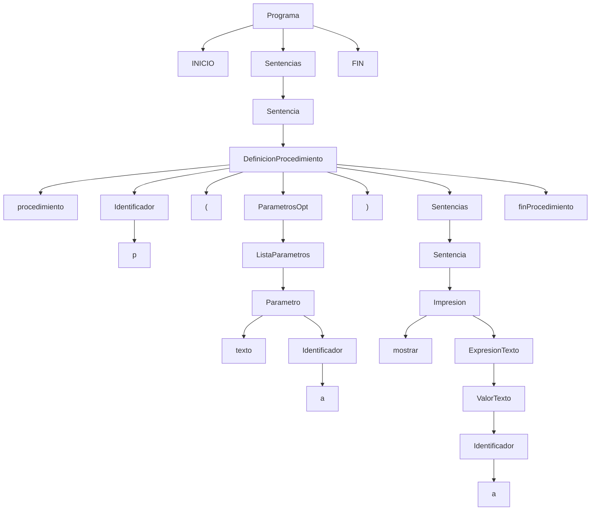

# Lenguaje de Seguridad Educativo


## Índice por TP

- [TP 3](#tp-3)
  - [ASD — Derivación a izquierda Descentende](#asd--derivación-a-izquierda-descentende)
  - [ASA — Orden inverso de la derivación a la derecha (reducción ascendente)](#asa--orden-inverso-de-la-derivación-a-la-derecha-reducción-ascendente)
  - [ASA — Derivación a la derecha](#asa--derivación-a-la-derecha)

- [TP 4: ASD con retroceso cadena](#tp-4-asd-con-retroceso-cadena)

- [TP5: Parsing ASCP LL (1) cadena](#tp5-parsing--ascp-ll-1-cadena)

- [TP 6](#tp-6)
  - [Bloque invertido](#bloque-invertido)
  - [Parsing ASA con retroceso cadena](#parsing-asa-con-retroceso-cadena)


## Objetivo

Ser un lenguaje de programación en español que permita expresar y automatizar tareas básicas de seguridad (detectar vulnerabilidades simples, validar entradas) de forma clara y accesible, con reglas simples y cercanas al ámbito de seguridad informática

## Alcance

### Incluye:

- **Tipos:** `numero`, `texto`, `vulnerabilidad` (`sqli|xss|rce`), `bool` (`vulnerable|seguro`), `lista<tipo_base>`.
- **Sentencias:** asignación, impresión, condicional (`evaluar`), iteración (`mientras`), funciones, procedimientos, operaciones de lista (`agregar`, `quitar`, `limpiar`).

## Tipos de datos

- **numero** → valor numérico entero.

- **texto** → cadena de caracteres (strings).

- **vulnerabilidad** → sqli | xss | rce (tipos básicos de vulnerabilidades).

- **bool** → vulnerable | seguro.

- **lista<tipo_base>** → lista tipada cuyos elementos son **numero**, **texto**, **vulnerabilidad** o **bool**.

- **lista<tipo_base>** → elementos de `numero | texto | vulnerabilidad | bool`.
  - Se pueden crear vacías con `vacia` o con literal `[]`.
  - **Indexación:** el primer índice es **0**.

## Estructura de programa

Un programa comienza con **`INICIO`** y termina con **`FIN.`**. Todas las sentencias válidas van entre esas dos palabras clave.

### Sentencias principales

### Asignación

- Declaración + asignación:  
  `anotar <tipo> <id> = <valor>`
- Reasignación:  
  `anotar <id> = <nuevo_valor>`
- Listas:
  - Crear: `anotar lista<tipo> <id> = []` o `anotar lista<tipo> <id> = vacia`
  - Acceso: `<lista>[<indice>]`

### Impresión

`mostrar` acepta una expresión de texto que puede concatenar con `+` variables, números, booleanos, accesos a lista o llamadas a función.  
Ej.: `mostrar "Sitio: " + sitio + " | Vulnerabilidad: " + tipo`

### Condicional

`evaluar <condicion>` ejecuta un bloque `si pasa:` y, opcionalmente, un bloque `si no pasa:`.

Negación: `no <condicion>`

Ej:` evaluar <condicion> si pasa: <sentencias> si no pasa <sentencia>`

### Iteración (únicamente mientras)

`mientras <condicion> hacer <sentencias>`
repite mientras la condición sea verdadera.

## Operaciones de lista

- `agregar <valor> a <lista>` (Se agrega al final de lista)

- `quitar en <lista>[<indice>]` (Elimina por índice) - si no tiene índice válido da error

- `limpiar <lista>` (Deja la lista vacía)

## Funciones y procedimientos

- **Funciones:** devuelven un valor con **retornar**. Se aceptan parametros

```
funcion <tipo> <nombre>(parámetros)
    sentencias
    retornar <valor>
finFuncion
```

- **Procedimientos:** no devuelven valor; se invocan como sentencia. Se aceptan parametros

```
procedimiento <nombre>(parámetros)
    sentencias
finProcedimiento
```

> Variables
> y parámetros de funciones/procedimientos son **locales**.

## Comentarios

- De línea: `// comentario`

- De bloque: `/* comentario */`

## Operadores

- **Aritméticos:** +, -, /, \*
  Se admiten paréntesis para agrupar: ( … ).

- **Relacionales:** ==, !=, <, >, <=, >= (se permiten en ambos lados valores/expresiones).

- **Lógicos:** y, o, no.

## Especificaciones léxicas

- Sensible a mayúsculas/minúsculas (**case-sensitive**).

- Comentarios: `// …` y `/* … */`.
- Números enteros no negativos, textos entre comillas `"…"`.
- Operadores y signos: `+ - * / == != < > <= >= ( ) [ ] ,` y lógicos `y`, `o`, `no`.
- Palabras clave: `INICIO`, `FIN.`, `anotar`, `mostrar`, `evaluar`, `si pasa:`, `si no pasa:`, `mientras`, `hacer`, `funcion`, `retornar`, `finFuncion`, `procedimiento`, `finProcedimiento`, `agregar`, `quitar`, `limpiar`, `vacia`, `vulnerable`, `seguro`, `probar`, `reportar`.

## Especificaciones sintácticas

- Programa: `INICIO <sentencias> FIN.`
- Asignación:
  - Declaración: `anotar <tipo> <id> = <valor>`
  - Reasignación: `anotar <id> = <valor>`
  - Listas: `anotar lista<tipo_base> L = []` o `vacia`; acceso `L[i]`
- Impresión: `mostrar <expresion_texto>` (concatenación con `+`).
- Condicional:

```
evaluar <condicion>
    si pasa: <sentencias>
    si no pasa: <sentencias>   // opcional
```

- Iteración: `mientras <condicion> hacer <sentencias>`
- Expresiones: precedencia `* /` > `+ -`; paréntesis para agrupar.

- Funciones: Se debe definir que tipo de dato devolvera la funcion al momento de crearla.

## Especificaciones semánticas

- **Tipos:** verificación estática; declarar tipo al crear variable.
- **vulnerabilidad:** debe estar en `[sqli,xss,rce]`.
- **Listas:** tipo base estricto; error si se inserta tipo distinto.
- **mostrar:** convierte a `texto` al concatenar/mostrar.
- **Ámbitos:** variables/params de funciones/procedimientos son locales.
- **Errores runtime:** índice fuera de rango, división por cero, etc.

## Funciones predefinidas

- **probar**: Evalúa si una entrada es vulnerable. Retorna `vulnerable` si es vulnerable, `seguro` si no es vulnerable.
- **reportar**: Genera un reporte de vulnerabilidad encontrada con el mensaje especificado.

## Función predefinida: probar (modo simulado)

### `probar` (modo simulado)

`probar(texto url, vulnerabilidad tipo, texto payload) -> bool`

**Descripción**

- Función predefinida del lenguaje.
- Simula un test de seguridad (no realiza requests HTTP reales).
- Imprime en consola el detalle de la prueba ejecutada.
- Devuelve `vulnerable` o `seguro` según reglas sobre el **payload**.

## Reglas de decisión

**Para `sqli`** → vulnerable si el payload contiene (**case-insensitive**):

- `' OR`
- `1=1`
- `UNION`
- `--`  
  En otro caso → **seguro**.

**Para `xss`** → vulnerable si el payload contiene:

- `<script>`
- `onerror=`
- `onload=`
- `"><`  
  En otro caso → **seguro**.

#### Para `rce`

**Para `rce`** → vulnerable si el payload contiene:

- `;`
- `&&`
- `|`
- `` ` `` (backtick)
- `$( )`
- `ping -c`  
  En otro caso → **seguro**.

**Log educativo**

`[probar] URL=https://ejemplo.com/login | Tipo=sqli | Payload="admin' OR 1=1--"`

### `reportar`

`reportar(texto mensaje) -> nada`  
Emite un reporte (consola/archivo según implementación del runtime).

## Ejemplo de uso (simple)

```
INICIO

anotar bool r1 = probar("https://ejemplo.com/login", sqli, "admin' OR 1=1--")
anotar bool r2 = probar("https://ejemplo.com/comentarios", xss, "Hola mundo")
anotar bool r3 = probar("https://ejemplo.com/admin", rce, "ping -c 1 127.0.0.1")

mostrar "Login vulnerable? " + r1
mostrar "Comentarios vulnerables? " + r2
mostrar "Admin vulnerable? " + r3

FIN.
```

## Salida simulada

```
[probar] URL=https://ejemplo.com/login | Tipo=sqli | Payload="admin' OR 1=1--"
[probar] URL=https://ejemplo.com/comentarios | Tipo=xss | Payload="Hola mundo"
[probar] URL=https://ejemplo.com/admin | Tipo=rce | Payload="ping -c 1 127.0.0.1"

Login vulnerable? vulnerable
Comentarios vulnerables? seguro
Admin vulnerable? vulnerable
```

## Ejemplo: Scanner básico de vulnerabilidades

> Ajustado a **índice base 0** y a la firma de `probar(url, tipo, payload)`.

## Reglas semánticas

- vulnerabilidad debe estar en [sqli|xss|rce].

- Tipos de listas estrictos (solo tipo_base permitido).

- Variables de función/procedimiento son locales.

- Todo valor se convierte a texto al imprimir/concatenar en mostrar.

## Ejemplo de uso

Salida simulada

### Ejemplo: Scanner básico de vulnerabilidades

```

INICIO

// Listas: sitios y tipos de vulnerabilidades. Se inicializan vacías
anotar lista<texto> sitios = []
anotar lista<vulnerabilidad> tipos = []
anotar lista<bool> resultados = []

// Carga de sitios a testear
agregar "https://ejemplo.com/login" a sitios
agregar "https://ejemplo.com/comentarios" a sitios
agregar "https://ejemplo.com/admin" a sitios

// Carga de tipos de vulnerabilidades
agregar sqli a tipos
agregar xss a tipos
agregar rce a tipos

// Cantidad de tests a realizar
anotar numero cantidad_tests = 3

// Procedimiento: imprime un reporte de vulnerabilidad
procedimiento mostrarReporte(texto sitio, vulnerabilidad tipo, bool estado)
mostrar "Sitio: " + sitio + " | Tipo: " + tipo + " | Estado: " + estado
finProcedimiento

// Función: estado según tipo de vulnerabilidad (bool)
funcion bool testearVulnerabilidad(texto sitio, vulnerabilidad tipo)
evaluar tipo == sqli
si pasa:
retornar probar(sitio, sqli, "admin' OR 1=1--")
si no pasa:
evaluar tipo == xss
si pasa:
retornar probar(sitio, xss, "Hola mundo")
si no pasa:
evaluar tipo == rce
si pasa:
retornar probar(sitio, rce, "ping -c 1 127.0.0.1")
si no pasa:
retornar seguro
finFuncion

// Función: contar vulnerabilidades encontradas
funcion numero contarVulnerabilidades(lista<bool> resultados, numero n)
anotar numero i = 0
anotar numero contador = 0
mientras i < n hacer
evaluar resultados[i] == vulnerable
si pasa:
anotar contador = contador + 1
anotar i = i + 1
retornar contador
finFuncion

// Recorrido con 'mientras' para testear todos los sitios
mostrar "Iniciando escaneo de vulnerabilidades:"
anotar numero i = 0
mientras i < cantidad_tests hacer
anotar texto sitio_actual = sitios[i]
anotar vulnerabilidad tipo_actual = tipos[i]
anotar bool resultado = testearVulnerabilidad(sitio_actual, tipo_actual)
agregar resultado a resultados
mostrarReporte(sitio_actual, tipo_actual, resultado)
anotar i = i + 1

// Resumen del escaneo
anotar numero total_vulnerabilidades = contarVulnerabilidades(resultados, cantidad_tests)
mostrar "Total de vulnerabilidades encontradas: " + total_vulnerabilidades

// Operaciones de lista: quitar y limpiar
mostrar "Quitando último test..."
quitar en sitios[2]
quitar en tipos[2]
quitar en resultados[2]
anotar cantidad_tests = 2

mostrar "Limpiando listas..."
limpiar sitios
limpiar tipos
limpiar resultados
FIN.

```

### Salida

```
Iniciando escaneo de vulnerabilidades:
Sitio: https://ejemplo.com/login | Tipo: sqli | Estado: vulnerable
Sitio: https://ejemplo.com/comentarios | Tipo: xss | Estado: seguro
Sitio: https://ejemplo.com/admin | Tipo: rce | Estado: vulnerable
Total de vulnerabilidades encontradas: 2
Quitando último test...
Limpiando listas...
```

## BNF

```
<programa> ::= INICIO <sentencias> FIN.
<sentencias> ::= <sentencia> <sentencias> | λ
<sentencia> ::= <asignacion> | <impresion> | <condicional> | <iteracion>
| <definicion_funcion>
| <definicion_procedimiento>
| <llamada_procedimiento>
| <operacion_lista>
<asignacion> ::= anotar <tipo> <identificador> = <valor>
| anotar <identificador> = <valor>
| anotar lista<tipo_base> <identificador> = vacia
<tipo> ::= numero | texto | vulnerabilidad | bool | lista<tipo_base>
<tipo_base> ::= numero | texto | vulnerabilidad | bool
<impresion> ::= mostrar <expresion_texto>
<expresion_texto> ::= <valor_texto> | <valor_texto> , <expresion_texto>;
<valor_texto> ::= <texto> | <identificador> | <booleano> | <numero>
| <acceso_lista> | <llamada_funcion
<condicional> ::= evaluar <condicion> <bloque_condicional>
<bloque_condicional> ::= si pasa: <sentencias>
| si pasa: <sentencias> si no pasa: <sentencias>
<condicion> ::= no <condicion>
| <valor> <operador_relacional> <valor>
| <condicion> <operador_logico> <condicion>
| <booleano> | <identificador>
<iteracion> ::= mientras <condicion> hacer <sentencias>
<valor> ::= <valor> <op_suma> <termino> | <termino>
<termino> ::= <termino> <op_mul> <factor> | <factor>
<factor> ::= <numero> | <texto> | <identificador> | <booleano>
| <acceso_lista> | <llamada_funcion> | "(" <valor> ")"
<op_suma> ::= + | -
<op_mul> ::= \* | /
<acceso_lista> ::= <identificador> [ <valor> ]
<operacion_lista> ::= agregar <valor> a <identificador>
| quitar en <identificador> [ <valor> ]
| limpiar <identificador>
<definicion_funcion> ::= funcion <tipo> <identificador> ( <parametros_opt> )
<sentencias>
retornar <valor>
finFuncion
<definicion_procedimiento> ::= procedimiento <identificador> ( <parametros_opt> )
<sentencias>
finProcedimiento
<llamada_funcion> ::= <identificador> ( <argumentos_opt> )
<llamada_procedimiento> ::= <identificador> ( <argumentos_opt> )
<parametros_opt> ::= λ | <lista_parametros>
<lista_parametros> ::= <parametro> | <parametro> , <lista_parametros>
<parametro> ::= <tipo> <identificador>
<argumentos_opt> ::= λ | <lista_argumentos>
<lista_argumentos> ::= <valor> | <valor> , <lista_argumentos>
<booleano> ::= vulnerable | seguro
<vulnerabilidad> ::= sqli | xss | rce
<operador_relacional> ::= == | != | < | > | <= | >=
<operador_logico> ::= y | o
<numero> ::= <digito> <numero> | <digito>
<texto> ::= "<contenido_texto>"
<contenido_texto ::= <identificador>
<identificador> ::= <letra> | <letra> <identificador> <letra> ::= a | b | ... | z | A | B | ... | Z
<digito> ::= 0 | 1 | ... | 9<comentario_linea> ::= "//" {cualquier_caracter_excepto_salto}
<comentario_bloque> ::= "/*" {cualquier_caracter} "*/"
<vacia> ::= vacia

```

## Árbol de derivación

Ej:

```
INICIO

procedimiento p(texto a)
mostrar a
finProcedimiento


FIN
```

## Árbol de Derivación - Grafico




# TP 3
## ASD — Derivación a izquierda Descentende

| Cadena de derivación obtenida                                                          | Próxima producción a aplicar                                                                        |
| -------------------------------------------------------------------------------------- | --------------------------------------------------------------------------------------------------- |
| Programa                                                                               | Programa → INICIO Sentencias FIN .                                                                  |
| INICIO Sentencias FIN .                                                                | Sentencias → Sentencia                                                                              |
| INICIO Sentencia FIN .                                                                 | Sentencia → DefinicionProcedimiento                                                                 |
| INICIO DefinicionProcedimiento FIN .                                                   | DefinicionProcedimiento → procedimiento Identificador ( ParametrosOpt ) Sentencias finProcedimiento |
| INICIO procedimiento Identificador ( ParametrosOpt ) Sentencias finProcedimiento FIN . | Identificador → p                                                                                   |
| INICIO procedimiento p ( ParametrosOpt ) Sentencias finProcedimiento FIN .             | ParametrosOpt → ListaParametros                                                                     |
| INICIO procedimiento p ( ListaParametros ) Sentencias finProcedimiento FIN .           | ListaParametros → Parametro                                                                         |
| INICIO procedimiento p ( Parametro ) Sentencias finProcedimiento FIN .                 | Parametro → Tipo Identificador                                                                      |
| INICIO procedimiento p ( texto Identificador ) Sentencias finProcedimiento FIN .       | Identificador → a                                                                                   |
| INICIO procedimiento p ( texto a ) Sentencias finProcedimiento FIN .                   | Sentencias → Sentencia                                                                              |
| INICIO procedimiento p ( texto a ) Sentencia finProcedimiento FIN .                    | Sentencia → Impresion                                                                               |
| INICIO procedimiento p ( texto a ) Impresion finProcedimiento FIN .                    | Impresion → mostrar ExpresionTexto                                                                  |
| INICIO procedimiento p ( texto a ) mostrar ExpresionTexto finProcedimiento FIN .       | ExpresionTexto → ValorTexto                                                                         |
| INICIO procedimiento p ( texto a ) mostrar ValorTexto finProcedimiento FIN .           | ValorTexto → Identificador                                                                          |
| INICIO procedimiento p ( texto a ) mostrar Identificador finProcedimiento FIN .        | Identificador → a                                                                                   |
| INICIO procedimiento p ( texto a ) mostrar a finProcedimiento FIN .                    | accept                                                                                              |

### ASA — Orden inverso de la derivación a la derecha (reducción ascendente)

| Cadena de derivación obtenida                                                    | Próxima producción a aplicar                                                                        |
| -------------------------------------------------------------------------------- | --------------------------------------------------------------------------------------------------- |
| INICIO procedimiento p ( texto a ) mostrar a finProcedimiento FIN .              | Identificador → a                                                                                   |
| INICIO procedimiento p ( texto a ) mostrar Identificador finProcedimiento FIN .  | ValorTexto → Identificador                                                                          |
| INICIO procedimiento p ( texto a ) mostrar ValorTexto finProcedimiento FIN .     | ExpresionTexto → ValorTexto                                                                         |
| INICIO procedimiento p ( texto a ) mostrar ExpresionTexto finProcedimiento FIN . | Impresion → mostrar ExpresionTexto                                                                  |
| INICIO procedimiento p ( texto a ) Impresion finProcedimiento FIN .              | Sentencia → Impresion                                                                               |
| INICIO procedimiento p ( texto a ) Sentencia finProcedimiento FIN .              | Sentencias → Sentencia                                                                              |
| INICIO procedimiento p ( texto Identificador ) Sentencias finProcedimiento FIN . | Identificador → a                                                                                   |
| INICIO procedimiento p ( texto a ) Sentencias finProcedimiento FIN .             | Parametro → Tipo Identificador                                                                      |
| INICIO procedimiento p ( Parametro ) Sentencias finProcedimiento FIN .           | ListaParametros → Parametro                                                                         |
| INICIO procedimiento p ( ListaParametros ) Sentencias finProcedimiento FIN .     | ParametrosOpt → ListaParametros                                                                     |
| INICIO procedimiento p ( ParametrosOpt ) Sentencias finProcedimiento FIN .       | DefinicionProcedimiento → procedimiento Identificador ( ParametrosOpt ) Sentencias finProcedimiento |
| INICIO DefinicionProcedimiento FIN .                                             | Sentencia → DefinicionProcedimiento                                                                 |
| INICIO Sentencia FIN .                                                           | Sentencias → Sentencia                                                                              |
| INICIO Sentencias FIN .                                                          | Programa → INICIO Sentencias FIN .                                                                  |
| Programa                                                                         | accept                                                                                              |

### ASA — Derivación a la derecha

| Cadena de trabajo (input → reducciones)                                                    | Producción aplicada                                                                                 |
| ------------------------------------------------------------------------------------------ | --------------------------------------------------------------------------------------------------- |
| **INICIO procedimiento p ( texto a ) mostrar a finProcedimiento FIN .**                    | —                                                                                                   |
| INICIO procedimiento p ( texto a ) **mostrar Identificador** finProcedimiento FIN .        | Identificador → a                                                                                   |
| INICIO procedimiento p ( texto a ) **mostrar ValorTexto** finProcedimiento FIN .           | ValorTexto → Identificador                                                                          |
| INICIO procedimiento p ( texto a ) **mostrar ExpresionTexto** finProcedimiento FIN .       | ExpresionTexto → ValorTexto                                                                         |
| INICIO procedimiento p ( texto a ) **Impresion** finProcedimiento FIN .                    | Impresion → mostrar ExpresionTexto                                                                  |
| INICIO procedimiento p ( texto a ) **Sentencia** finProcedimiento FIN .                    | Sentencia → Impresion                                                                               |
| INICIO procedimiento p ( texto a ) **Sentencias** finProcedimiento FIN .                   | Sentencias → Sentencia                                                                              |
| INICIO procedimiento p ( **Tipo** a ) Sentencias finProcedimiento FIN .                    | Tipo → texto                                                                                        |
| INICIO procedimiento p ( Tipo **Identificador** ) Sentencias finProcedimiento FIN .        | Identificador → a                                                                                   |
| INICIO procedimiento p ( **Parametro** ) Sentencias finProcedimiento FIN .                 | Parametro → Tipo Identificador                                                                      |
| INICIO procedimiento p ( **ListaParametros** ) Sentencias finProcedimiento FIN .           | ListaParametros → Parametro                                                                         |
| INICIO procedimiento p ( **ParametrosOpt** ) Sentencias finProcedimiento FIN .             | ParametrosOpt → ListaParametros                                                                     |
| INICIO procedimiento **Identificador** ( ParametrosOpt ) Sentencias finProcedimiento FIN . | Identificador → p                                                                                   |
| INICIO **DefinicionProcedimiento** FIN .                                                   | DefinicionProcedimiento → procedimiento Identificador ( ParametrosOpt ) Sentencias finProcedimiento |
| INICIO **Sentencia** FIN .                                                                 | Sentencia → DefinicionProcedimiento                                                                 |
| INICIO **Sentencias** FIN .                                                                | Sentencias → Sentencia                                                                              |
| **Programa**                                                                               | Programa → INICIO Sentencias FIN .                                                                  |
| **accept**                                                                                 | —                                                                                                   |

# Análisis Sintáctico Descendente (ASD)

Programa de entrada:

```
INICIO

procedimiento p(texto a)
mostrar a
finProcedimiento

FIN
```

---

##  GIC (Pila) para el ejemplo

_GIC = ⟨ΣN, ΣT, S, P⟩_

- **ΣN** = { Programa, Sentencias, Sentencia, DefinicionProcedimiento, ParametrosOpt, ListaParametros, Parametro, Tipo, Identificador, Impresion, ExpresionTexto, ValorTexto }
- **ΣT** = { `INICIO`, `FIN`, `procedimiento`, `finProcedimiento`, `(`, `)`, `texto`, `mostrar`, `p`, `a` }
- **S** = `Programa`
- **P** (solo las necesarias para esta entrada):

```
δ(q0, λ, λ)        => (q1, Z)
δ(q1, λ, λ)        => (q2, Programa)

; Expansiones por λ
δ(q2, λ, Programa)             => (q2, INICIO Sentencias FIN)

; Bloque global: primera Sentencias se expande en una Sentencia (la definición)
δ(q2, λ, Sentencias)           => (q2, Sentencia Sentencias)
δ(q2, λ, Sentencia)            => (q2, DefinicionProcedimiento)

δ(q2, λ, DefinicionProcedimiento)
  => (q2, procedimiento Identificador ( ParametrosOpt ) Sentencias finProcedimiento)

; Nombre de la función/proc
δ(q2, λ, Identificador)        => (q2, p)

; Parámetros
δ(q2, λ, ParametrosOpt)        => (q2, ListaParametros)
δ(q2, λ, ListaParametros)      => (q2, Parametro)
δ(q2, λ, Parametro)            => (q2, Tipo Identificador)
δ(q2, λ, Tipo)                 => (q2, texto)
δ(q2, λ, Identificador)        => (q2, a)

; Cuerpo del procedimiento: una Impresión
δ(q2, λ, Sentencias)           => (q2, Sentencia Sentencias)
δ(q2, λ, Sentencia)            => (q2, Impresion)
δ(q2, λ, Impresion)            => (q2, mostrar ExpresionTexto)
δ(q2, λ, ExpresionTexto)       => (q2, ValorTexto)
δ(q2, λ, ValorTexto)           => (q2, Identificador)
δ(q2, λ, Identificador)        => (q2, a)

; Fin del cuerpo del procedimiento
δ(q2, λ, Sentencias)           => (q2, λ)

; Fin del bloque global (después de la definición no hay más sentencias)
δ(q2, λ, Sentencias)           => (q2, λ)

; Matcheos de terminales (consumen input)
δ(q2, INICIO, INICIO)                  => (q2, λ)
δ(q2, procedimiento, procedimiento)    => (q2, λ)
δ(q2, p, p)                            => (q2, λ)
δ(q2, (, ()                             => (q2, λ)
δ(q2, texto, texto)                    => (q2, λ)
δ(q2, a, a)                            => (q2, λ)
δ(q2, ), ))                             => (q2, λ)
δ(q2, mostrar, mostrar)                => (q2, λ)
δ(q2, a, a)                            => (q2, λ)
δ(q2, finProcedimiento, finProcedimiento) => (q2, λ)
δ(q2, FIN, FIN)                        => (q2, λ)

; Aceptación
δ(q2, λ, Z) => (q3, λ)
```

## TP 4: ASD con retroceso cadena


| Pila                                                                                       | Cadena                                                            | Transición                                                                                                          |
| ------------------------------------------------------------------------------------------ | ----------------------------------------------------------------- | ------------------------------------------------------------------------------------------------------------------- |
| λ                                                                                          | INICIO procedimiento p ( texto a ) mostrar a finProcedimiento FIN | δ(q0, λ, λ) ⇒ (q1, Z)                                                                                               |
| Z                                                                                          | INICIO procedimiento p ( texto a ) mostrar a finProcedimiento FIN | δ(q1, λ, λ) ⇒ (q2, Programa)                                                                                        |
| Z Programa                                                                                 | INICIO procedimiento p ( texto a ) mostrar a finProcedimiento FIN | δ(q2, λ, Programa) ⇒ (q2, INICIO Sentencias FIN)                                                                    |
| Z FIN Sentencias INICIO                                                                    | INICIO procedimiento p ( texto a ) mostrar a finProcedimiento FIN | δ(q2, INICIO, INICIO) ⇒ (q2, λ)                                                                                     |
| Z FIN Sentencias                                                                           | procedimiento p ( texto a ) mostrar a finProcedimiento FIN        | δ(q2, λ, Sentencias) ⇒ (q2, Sentencia Sentencias)                                                                   |
| Z FIN Sentencias Sentencia                                                                 | procedimiento p ( texto a ) mostrar a finProcedimiento FIN        | δ(q2, λ, Sentencia) ⇒ (q2, DefinicionProcedimiento)                                                                 |
| Z FIN Sentencias DefinicionProcedimiento                                                   | procedimiento p ( texto a ) mostrar a finProcedimiento FIN        | δ(q2, λ, DefinicionProcedimiento) ⇒ (q2, procedimiento Identificador ( ParametrosOpt ) Sentencias finProcedimiento) |
| Z FIN Sentencias finProcedimiento Sentencias ) ParametrosOpt ( Identificador procedimiento | procedimiento p ( texto a ) mostrar a finProcedimiento FIN        | δ(q2, procedimiento, procedimiento) ⇒ (q2, λ)                                                                       |
| Z FIN Sentencias finProcedimiento Sentencias ) ParametrosOpt ( Identificador               | p ( texto a ) mostrar a finProcedimiento FIN                      | δ(q2, λ, Identificador) ⇒ (q2, p)                                                                                   |
| Z FIN Sentencias finProcedimiento Sentencias ) ParametrosOpt ( p                           | p ( texto a ) mostrar a finProcedimiento FIN                      | δ(q2, p, p) ⇒ (q2, λ)                                                                                               |
| Z FIN Sentencias finProcedimiento Sentencias ) ParametrosOpt (                             | ( texto a ) mostrar a finProcedimiento FIN                        | δ(q2, (, () ⇒ (q2, λ)                                                                                               |
| Z FIN Sentencias finProcedimiento Sentencias ) ParametrosOpt                               | texto a ) mostrar a finProcedimiento FIN                          | δ(q2, λ, ParametrosOpt) ⇒ (q2, ListaParametros)                                                                     |
| Z FIN Sentencias finProcedimiento Sentencias ) ListaParametros                             | texto a ) mostrar a finProcedimiento FIN                          | δ(q2, λ, ListaParametros) ⇒ (q2, Parametro)                                                                         |
| Z FIN Sentencias finProcedimiento Sentencias ) Parametro                                   | texto a ) mostrar a finProcedimiento FIN                          | δ(q2, λ, Parametro) ⇒ (q2, Tipo Identificador)                                                                      |
| Z FIN Sentencias finProcedimiento Sentencias ) Identificador Tipo                          | texto a ) mostrar a finProcedimiento FIN                          | δ(q2, λ, Tipo) ⇒ (q2, texto)                                                                                        |
| Z FIN Sentencias finProcedimiento Sentencias ) Identificador texto                         | texto a ) mostrar a finProcedimiento FIN                          | δ(q2, texto, texto) ⇒ (q2, λ)                                                                                       |
| Z FIN Sentencias finProcedimiento Sentencias ) Identificador                               | a ) mostrar a finProcedimiento FIN                                | δ(q2, λ, Identificador) ⇒ (q2, a)                                                                                   |
| Z FIN Sentencias finProcedimiento Sentencias ) a                                           | a ) mostrar a finProcedimiento FIN                                | δ(q2, a, a) ⇒ (q2, λ)                                                                                               |
| Z FIN Sentencias finProcedimiento Sentencias )                                             | ) mostrar a finProcedimiento FIN                                  | δ(q2, ), )) ⇒ (q2, λ)                                                                                               |
| Z FIN Sentencias finProcedimiento Sentencias                                               | mostrar a finProcedimiento FIN                                    | δ(q2, λ, Sentencias) ⇒ (q2, Sentencia Sentencias)                                                                   |
| Z FIN Sentencias finProcedimiento Sentencias Sentencia                                     | mostrar a finProcedimiento FIN                                    | δ(q2, λ, Sentencia) ⇒ (q2, Impresion)                                                                               |
| Z FIN Sentencias finProcedimiento Sentencias Impresion                                     | mostrar a finProcedimiento FIN                                    | δ(q2, λ, Impresion) ⇒ (q2, mostrar ExpresionTexto)                                                                  |
| Z FIN Sentencias finProcedimiento Sentencias ExpresionTexto mostrar                        | mostrar a finProcedimiento FIN                                    | δ(q2, mostrar, mostrar) ⇒ (q2, λ)                                                                                   |
| Z FIN Sentencias finProcedimiento Sentencias ExpresionTexto                                | a finProcedimiento FIN                                            | δ(q2, λ, ExpresionTexto) ⇒ (q2, ValorTexto)                                                                         |
| Z FIN Sentencias finProcedimiento Sentencias ValorTexto                                    | a finProcedimiento FIN                                            | δ(q2, λ, ValorTexto) ⇒ (q2, Identificador)                                                                          |
| Z FIN Sentencias finProcedimiento Sentencias Identificador                                 | a finProcedimiento FIN                                            | δ(q2, λ, Identificador) ⇒ (q2, a)                                                                                   |
| Z FIN Sentencias finProcedimiento Sentencias a                                             | a finProcedimiento FIN                                            | δ(q2, a, a) ⇒ (q2, λ)                                                                                               |
| Z FIN Sentencias finProcedimiento Sentencias                                               | finProcedimiento FIN                                              | δ(q2, λ, Sentencias) ⇒ (q2, λ)                                                                                      |
| Z FIN Sentencias finProcedimiento                                                          | finProcedimiento FIN                                              | δ(q2, finProcedimiento, finProcedimiento) ⇒ (q2, λ)                                                                 |
| Z FIN Sentencias                                                                           | FIN                                                               | δ(q2, λ, Sentencias) ⇒ (q2, λ)                                                                                      |
| Z FIN                                                                                      | FIN                                                               | δ(q2, FIN, FIN) ⇒ (q2, λ)                                                                                           |
| Z                                                                                          | λ                                                                 | δ(q2, λ, Z) ⇒ (q3, λ)                                                                                               |
| λ                                                                                          | λ                                                                 | **accept**                                                                                                          |


## TP5: Parsing  ASCP LL (1) cadena


# TP 6: 

### Bloque invertido

```

δ(q0, λ, Z) => (q1, λ)
δ(q1, λ, Programa) => (q2, λ)

; Expansiones por λ (invertidas)
δ(q2, INICIO Sentencias FIN, Programa) => (q2, λ)

; Bloque global: primera Sentencias se expande en una Sentencia (la definición)
δ(q2, Sentencia Sentencias, Sentencias) => (q2, λ)
δ(q2, DefinicionProcedimiento, Sentencia) => (q2, λ)

δ(q2, procedimiento Identificador ( ParametrosOpt ) Sentencias finProcedimiento, DefinicionProcedimiento) => (q2, λ)

; Nombre de la función/proc
δ(q2, p, Identificador) => (q2, λ)

; Parámetros
δ(q2, ListaParametros, ParametrosOpt) => (q2, λ)
δ(q2, Parametro, ListaParametros) => (q2, λ)
δ(q2, Tipo Identificador, Parametro) => (q2, λ)
δ(q2, texto, Tipo) => (q2, λ)
δ(q2, a, Identificador) => (q2, λ)

; Cuerpo del procedimiento: una Impresión
δ(q2, Sentencia Sentencias, Sentencias) => (q2, λ)
δ(q2, Impresion, Sentencia) => (q2, λ)
δ(q2, mostrar ExpresionTexto, Impresion) => (q2, λ)
δ(q2, ValorTexto, ExpresionTexto) => (q2, λ)
δ(q2, Identificador, ValorTexto) => (q2, λ)
δ(q2, a, Identificador) => (q2, λ)

; Fin del cuerpo del procedimiento
δ(q2, λ, Sentencias) => (q2, λ)

; Fin del bloque global (después de la definición no hay más sentencias)
δ(q2, λ, Sentencias) => (q2, λ)

; Matcheos de terminales (consumen input)
δ(q2, INICIO, INICIO) => (q2, λ)
δ(q2, procedimiento, procedimiento) => (q2, λ)
δ(q2, p, p) => (q2, λ)
δ(q2, (, () => (q2, λ)
δ(q2, texto, texto) => (q2, λ)
δ(q2, a, a) => (q2, λ)
δ(q2, ), )) => (q2, λ)
δ(q2, mostrar, mostrar) => (q2, λ)
δ(q2, a, a) => (q2, λ)
δ(q2, finProcedimiento, finProcedimiento) => (q2, λ)
δ(q2, FIN, FIN) => (q2, λ)

; Aceptación
δ(q2, λ, Z) => (q3, λ)
```

### Parsing ASA con retroceso cadena


| Pila                                                                                       | Cadena                                                            | Transición                                       |
| ------------------------------------------------------------------------------------------ | ----------------------------------------------------------------- | ------------------------------------------------ |
| λ                                                                                          | INICIO procedimiento p(texto a) mostrar a finProcedimiento FIN     | δ(q0, λ, λ) ⇒ (q1, Z)                            |
| Z                                                                                          | INICIO procedimiento p(texto a) mostrar a finProcedimiento FIN     | shift                                            |
| Z INICIO                                                                                   | procedimiento p(texto a) mostrar a finProcedimiento FIN            | shift                                            |
| Z INICIO procedimiento                                                                     | p(texto a) mostrar a finProcedimiento FIN                          | shift                                            |
| Z INICIO procedimiento p                                                                   | (texto a) mostrar a finProcedimiento FIN                           | reduce                                           |
| Z INICIO procedimiento Identificador                                                       | (texto a) mostrar a finProcedimiento FIN                           | shift                                            |
| Z INICIO procedimiento Identificador (                                                     | texto a) mostrar a finProcedimiento FIN                            | shift                                            |
| Z INICIO procedimiento Identificador (texto                                                | a) mostrar a finProcedimiento FIN                                  | reduce                                           |
| Z INICIO procedimiento Identificador (Tipo                                                 | a) mostrar a finProcedimiento FIN                                  | shift                                            |
| Z INICIO procedimiento Identificador (Tipo a                                               | ) mostrar a finProcedimiento FIN                                   | reduce                                           |
| Z INICIO procedimiento Identificador (Tipo Identificador                                   | ) mostrar a finProcedimiento FIN                                   | reduce                                           |
| Z INICIO procedimiento Identificador (Parametro                                            | ) mostrar a finProcedimiento FIN                                   | reduce                                           |
| Z INICIO procedimiento Identificador (ListaParametros                                      | ) mostrar a finProcedimiento FIN                                   | reduce                                           |
| Z INICIO procedimiento Identificador (ParametrosOpt                                        | ) mostrar a finProcedimiento FIN                                   | shift                                            |
| Z INICIO procedimiento Identificador (ParametrosOpt )                                      | mostrar a finProcedimiento FIN                                     | shift                                            |
| Z INICIO procedimiento Identificador (ParametrosOpt ) mostrar                              | a finProcedimiento FIN                                             | shift                                            |
| Z INICIO procedimiento Identificador (ParametrosOpt ) mostrar a                            | finProcedimiento FIN                                               | reduce                                           |
| Z INICIO procedimiento Identificador (ParametrosOpt ) mostrar Identificador                | finProcedimiento FIN                                               | reduce                                           |
| Z INICIO procedimiento Identificador (ParametrosOpt ) mostrar ValorTexto                   | finProcedimiento FIN                                               | reduce                                           |
| Z INICIO procedimiento Identificador (ParametrosOpt ) mostrar ExpresionTexto               | finProcedimiento FIN                                               | reduce                                           |
| Z INICIO procedimiento Identificador (ParametrosOpt ) mostrar Impresion                    | finProcedimiento FIN                                               | reduce                                           |
| Z INICIO procedimiento Identificador (ParametrosOpt ) mostrar Sentencia                    | finProcedimiento FIN                                               | reduce                                           |
| Z INICIO procedimiento Identificador (ParametrosOpt ) mostrar Sentencia Sentencias         | finProcedimiento FIN                                               | reduce                                           |
| Z INICIO procedimiento Identificador (ParametrosOpt ) mostrar Sentencias                   | finProcedimiento FIN                                               | shift                                            |
| Z INICIO procedimiento Identificador (ParametrosOpt ) mostrar Sentencias finProcedimiento  | FIN                                                                | reduce                                           |
| Z INICIO DefinicionProcedimiento                                                          | FIN                                                                | reduce                                           |
| Z INICIO Sentencia                                                                         | FIN                                                                | reduce                                           |
| Z INICIO Sentencia Sentencias                                                              | FIN                                                                | reduce                                           |
| Z INICIO Sentencias                                                                        | FIN                                                                | shift                                            |
| Z INICIO Sentencias FIN                                                                    | λ                                                                  | reduce                                           |
| Z Programa                                                                                 | λ                                                                  | δ(q1, λ, Programa) ⇒ (q2, λ)                     |
| Z                                                                                          | λ                                                                  | δ(q2, λ, Z) ⇒ (q3, λ)                            |
| λ                                                                                          | λ                                                                  | accept                                           |
